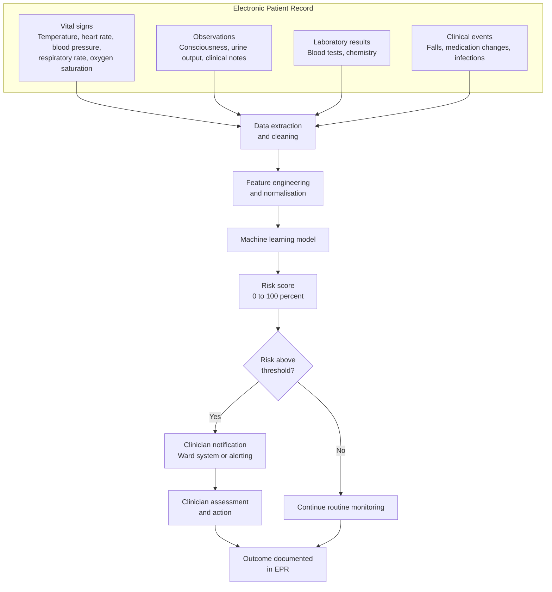

## Scenario 2 - AI Patient Deterioration Prediction

**Risk level:** High

### Business Problem

Clinical deterioration can occur rapidly and unpredictably. Early identification of at-risk patients allows clinicians to intervene before a patient becomes critically ill, improving outcomes and reducing emergency interventions, intensive care admissions, and mortality. Current manual Early Warning Score (EWS) systems rely on periodic observations and clinician assessment. Deterioration between observation points may be missed, and the cognitive burden of continuous monitoring diverts clinical attention.

The Trust receives approximately 50,000 patient admissions annually. Unplanned critical events, cardiac arrests, and unplanned intensive care admissions represent a significant clinical risk and financial impact. Earlier identification and intervention are clinical and organisational priorities.

### Proposed Solution

The Trust is considering an AI-powered patient deterioration prediction system. The system continuously ingests clinical observations, vital signs, laboratory results, and clinical events from the Electronic Patient Record (EPR). Using supervised machine learning, the system predicts the risk that a patient will experience clinical deterioration (unplanned critical event, cardiac arrest, unplanned ICU admission, or death) within a defined time window (e.g. 24 to 72 hours).

The system generates risk scores and alerts clinicians when predicted risk exceeds configurable thresholds. Clinicians review the alert, assess the patient, and decide whether to escalate care, increase monitoring, or take other clinical action.

**Scenario status:** Proposed. This scenario does not constitute approval for deployment.

### Processing Flow

### Data Involved

Potentially processed data includes:

- Patient name
- NHS number
- Age, sex, ethnicity
- Hospital admission date and reason
- Vital signs (temperature, heart rate, blood pressure, respiratory rate, oxygen saturation, consciousness level)
- Urine output and fluid balance
- Laboratory results (full blood count, chemistry, coagulation, blood gases)
- Medications and medication changes
- Clinical observations and nursing notes
- Clinical events (falls, infections, interventions)
- Comorbidities and medical history
- Current clinical status and care level (general ward, high-dependency, intensive care)
- Outcomes (discharge, death, unplanned transfer to intensive care)

The exact data retention, processing purposes, access controls, deletion, aggregation, and model retraining use remain governance questions to evidence.

### Third Party

The AI model may be developed internally, acquired from a commercial vendor, or built using cloud-hosted machine learning platforms (e.g. Azure Machine Learning, AWS SageMaker). If vendor-supplied or cloud-hosted, the following require assessment:

- Model provider and vendor accountability
- Data location and processing jurisdiction
- Retention of training data and model artefacts
- Subprocessors and third-party access (including cloud infrastructure providers)
- Whether vendor or infrastructure provider can access patient data for model improvement, support, or analytics
- Service change procedures (including model updates, retraining, configuration changes)
- Data export, model portability, and exit strategy
- Incident notification and management obligations
- Security, encryption, access control, and identity management
- Audit rights and audit trails
- Liability, indemnity, and insurance
- Regulatory compliance (UK GDPR, Data Protection Act 2018, NHS standard contracts)

### Governance Questions

The AI Governance team must determine:

1. **Model Development & Validation**
   - How was the model trained and validated?
   - What training data was used, and from which populations?
   - What is the model's sensitivity, specificity, and predictive value across patient subgroups (age, sex, ethnicity, comorbidity)?
   - How does the model perform in this Trust's patient population?
   - What is the false-positive and false-negative rate?
   - What happens when the model encounters data outside its training distribution?

2. **Clinical Safety & Accuracy**
   - What is the clinical definition of "deterioration" that the model predicts?
   - Are predictions clinically interpretable and actionable?
   - Can clinicians understand why a risk alert was generated?
   - What is the clinical impact of false positives (alert fatigue, unnecessary escalation)?
   - What is the clinical impact of false negatives (missed deterioration, patient harm)?
   - What is the expected change in clinical outcomes?

3. **Bias & Fairness**
   - Does the model perform equally across age groups, sexes, ethnicities, and comorbidity groups?
   - Are there known or suspected biases in model predictions?
   - How will bias be monitored in operation?
   - What redress is available if a patient is harmed by a biased prediction?

4. **Human Oversight & Accountability**
   - How do clinicians access and interpret risk alerts?
   - Can clinicians override or suppress alerts?
   - What training will clinicians receive?
   - Who is accountable if a clinician ignores an alert and the patient deteriorates?
   - Who is accountable if an alert causes unnecessary escalation or intervention?
   - How is the clinician decision (to act or not act) recorded?

5. **Data Processing & Privacy**
   - Is processing necessary and proportionate for the stated clinical purpose?
   - What legal basis justifies continuous data collection and processing?
   - Are patients informed and can they object?
   - How is patient data protected from unauthorised access?
   - What is the data retention period?
   - Is patient data used for model retraining or secondary purposes?
   - How are data deletion, anonymisation, and export requests handled?
   - What is the Trust's data-sharing agreement with any vendor or cloud provider?

6. **System Availability & Resilience**
   - What happens when the AI system becomes unavailable?
   - Can the system fail safely (e.g. alert clinicians if the system stops)?
   - What is the recovery time objective?
   - Are there manual fallback procedures?
   - What is the single point of failure risk?

7. **Monitoring & Incident Management**
   - How will model performance be monitored in operation?
   - What metrics will be tracked (accuracy, false-positive rate, clinical outcomes)?
   - How frequently will performance be reviewed?
   - Who is responsible for monitoring?
   - How will clinical incidents related to the AI system be detected and reported?
   - What is the escalation pathway for incidents?
   - How will the system be paused, restricted, or retired if harm is detected?

8. **Vendor Management** (if applicable)
   - What is the vendor's track record with similar systems?
   - What security and privacy certifications does the vendor hold?
   - What audit rights does the Trust have?
   - What happens if the vendor changes the underlying model or data processing?
   - What is the contract termination and exit strategy?
   - Does the contract include liability caps that inappropriately limit accountability for patient harm?

### Initial Governance Scope

Assess this use case through the portfolio workflows for:

- **Clinical Safety & Patient Impact:** Predictive accuracy, sensitivity and specificity by patient subgroup, false-positive and false-negative rates, clinical interpretability, clinician override and accountability, monitoring of real-world outcomes, incident detection and escalation.

- **Equity & Fairness:** Performance across age, sex, ethnicity, comorbidity, and socioeconomic groups; bias detection and mitigation; impact on vulnerable populations; redress mechanisms.

- **Privacy & Data Protection:** Legal basis for continuous data collection and processing, patient information and consent, data retention and deletion, secondary use for retraining, vendor and cloud-provider access, UK GDPR compliance, Data Protection Act 2018 compliance, NHS standard contracts.

- **Security & Resilience:** Encryption and access control, identity and access management, audit trails, vulnerability management, system availability and recovery, failure mode analysis, incident response, business continuity.

- **Human Factors & Accountability:** Clinician training, human override and decision recording, alert fatigue and clinical judgment, accountability for clinician action or inaction, organisational responsibility for system performance, escalation pathways.

- **Vendor Management** (if applicable): Vendor security posture, audit rights, incident obligations, service-change procedures, data processing terms, subprocessors, exit strategy, liability and indemnity.

- **Monitoring & Assurance:** Performance baseline and metrics, monitoring cadence and responsibility, incident detection triggers, performance degradation thresholds, change control procedures, periodic clinical audit, independent assurance.

- **Lifecycle Governance:** Pre-deployment testing and validation, pilot scope and evaluation, approval gates and decision authority, deployment rollback procedures, suspension criteria, decommissioning plan if outcomes do not meet expectations.

The decision requested is whether the use case can proceed to the next governance gate, and under what evidence, controls, assurance conditions, risk-tolerance decision, and accountability arrangements.
