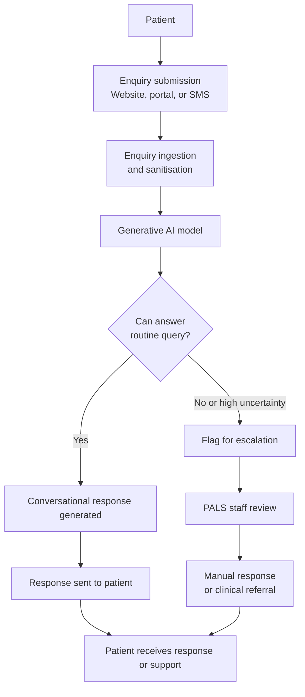

## Scenario 3 - Generative AI Patient Service Assistant

**Risk level:** Medium

### Business Problem

Patients and carers contact the Trust with routine enquiries: appointment information, test results, medication queries, visiting arrangements, billing questions, and general information about services. The patient advice and liaison service (PALS) and main switchboard handle thousands of enquiries annually, creating significant staffing burden and wait times.

Many enquiries follow predictable patterns and require only information retrieval or guidance to self-serve systems. Reducing the workload on PALS and switchboard would allow staff to focus on complex queries and patient complaints. Improved access to routine information would enhance patient experience and potentially reduce unnecessary clinical contacts.

### Proposed Solution

The Trust is considering a generative AI patient service assistant chatbot. The system is accessible via the Trust website, patient portal, and SMS. Patients submit enquiries in natural language. A generative AI model (based on a large language model) produces conversational responses to frequently asked questions about appointments, test results, visiting hours, medications, services, billing, accessibility, and general health information.

The chatbot attempts to answer routine queries directly. For complex queries, clinical concerns, or patient safeguarding issues, the chatbot recognises the need for human review and escalates to a member of the PALS team or clinical staff, providing context to enable rapid resolution.

**Scenario status:** Proposed. This scenario does not constitute approval for deployment.

### Processing Flow

### Data Involved

Data potentially processed includes:

- Patient name
- NHS number
- Contact information (email, phone, SMS)
- Enquiry content (may include clinical information, symptoms, medication, medical history)
- Patient identifier and authentication data (to link enquiry to medical record)
- Appointment and test-result data (retrieved from EPR to inform response)
- Visit history and engagement patterns
- Patient preferences and accessibility needs
- PALS and clinician review notes
- System interaction logs (enquiry, response, escalation, outcome)

The exact data flow, retention, usage for model training or improvement, access by third parties, and deletion procedures remain governance questions to evidence.

### Third Party

The chatbot system may be:

- Developed internally using open-source or commercial LLM models
- Acquired from a commercial chatbot or customer-service vendor
- Built on a commercial cloud platform offering LLM and conversational AI services (e.g. Azure OpenAI, AWS Bedrock, Google Cloud Vertex AI)

If vendor-supplied or cloud-hosted, the following require assessment:

- Vendor or platform provider and their track record in healthcare
- Whether the model or service is trained on patient data from other organisations
- Data location, processing jurisdiction, and regulatory compliance
- Whether the vendor or platform provider can access, analyse, or use patient enquiries for model improvement, analytics, or other purposes
- Procedures for model updates, retraining, and configuration changes
- Data export, portability, and exit strategy
- Incident notification and management obligations
- Security, encryption, access control, and audit trails
- Subprocessors and third-party access
- Liability, indemnity, and insurance, particularly for harm resulting from inaccurate or harmful responses
- Regulatory compliance with UK GDPR, Data Protection Act 2018, NHS standard contracts, health-sector guidance on AI

### Governance Questions

The AI Governance team must determine:

1. **Model & Data Training**
   - What training data was used to develop the underlying LLM?
   - Was patient data from other NHS trusts or health systems included in training?
   - What is known about potential biases, gaps, or limitations in the training data?
   - How frequently is the model updated or retrained?
   - Can the organisation veto or control model updates?

2. **Response Accuracy & Harmful Outputs**
   - How accurate are the chatbot's responses for the target enquiry types?
   - How often does the chatbot generate incorrect, misleading, or harmful information?
   - What is the rate of inappropriate medical advice (e.g. suggesting self-treatment for conditions requiring clinical review)?
   - How does the chatbot perform on edge cases, ambiguous enquiries, or out-of-scope questions?
   - What safeguards prevent the chatbot from providing dangerous recommendations?
   - How is "hallucination" (fabricated information) prevented or detected?
   - Are there known topics or enquiry types on which the chatbot is unreliable?

3. **Patient Safety & Clinical Risk**
   - Could a patient be harmed if they rely on the chatbot's response instead of seeking clinical advice?
   - How does the chatbot differentiate between routine queries and clinical concerns?
   - What triggers escalation to clinical review?
   - Are there scenarios where the chatbot's response might delay appropriate clinical assessment?
   - How is information about urgent symptoms, red flags, or safety-critical advice handled?
   - What happens if a patient with suicidal ideation, self-harm risk, or safeguarding concerns contacts the chatbot?

4. **Transparency & Patient Consent**
   - Are patients informed that they are interacting with an AI system?
   - Is the distinction between AI-generated and human-reviewed responses clear to patients?
   - Can patients opt out of chatbot interaction and request human contact?
   - Is patient consent obtained for data processing by the chatbot system?
   - What privacy notice is provided regarding data use, retention, and third-party access?
   - Can patients access, correct, or delete their enquiry records?

5. **Liability & Accountability**
   - Who is liable if the chatbot provides incorrect medical information that harms a patient?
   - Is the liability appropriately allocated between the vendor, the Trust, and clinicians?
   - Are vendor liability caps appropriate for healthcare and patient harm?
   - What indemnity and insurance arrangements are in place?
   - What is the redress pathway if a patient is harmed?
   - How is the Trust protected if the vendor's model changes without notice?

6. **Data Protection & Privacy**
   - What is the legal basis for collecting patient data through the chatbot?
   - Is processing necessary and proportionate for the stated patient-service purpose?
   - How are enquiries (which may contain sensitive health information) protected?
   - Are enquiries encrypted in transit and at rest?
   - Who can access enquiry records and under what circumstances?
   - Is patient data shared with the vendor, cloud platform, or third parties?
   - How long are enquiries retained?
   - Are enquiries used for model training or improvement without explicit patient consent?
   - How are DPIA, privacy impact, and third-party data-processing assessments conducted?

7. **Bias & Fairness**
   - Does the chatbot provide consistent and fair information to patients of different ages, sexes, ethnicities, and backgrounds?
   - Are there known biases in the underlying LLM that could result in discriminatory or inappropriate responses?
   - How is bias detected and monitored in operation?
   - Are there populations for whom the chatbot is known to be unreliable?
   - What mechanisms exist to detect and remediate discriminatory outcomes?

8. **Escalation & Human Oversight**
   - How does the chatbot decide when to escalate an enquiry to human review?
   - What is the escalation pathway, and what training do reviewers receive?
   - How quickly are escalated enquiries reviewed?
   - Can a patient request human review of a chatbot response?
   - Are escalation decisions and outcomes tracked and monitored?
   - How is performance of the escalation system assessed?

9. **Monitoring, Incident Detection & Response**
   - How will the chatbot's performance be monitored in operation?
   - What metrics will be tracked (response accuracy, escalation rate, patient satisfaction, incident reports)?
   - How frequently will performance be reviewed?
   - Who is responsible for monitoring?
   - How will patient harm incidents related to chatbot responses be detected?
   - What is the escalation pathway for incidents?
   - How will the chatbot be paused, restricted, or retired if harm is detected?
   - Are there automated safeguards to detect and prevent harmful responses (e.g. filtering inappropriate medical advice)?

10. **Vendor Management** (if applicable)
    - What is the vendor's or platform provider's experience with healthcare and NHS systems?
    - What security, privacy, and quality certifications do they hold?
    - What audit rights and transparency does the Trust have?
    - What happens if the vendor changes the underlying model, training data, or processing practices?
    - What is the notice period for service changes?
    - What is the contract termination and exit strategy?
    - How are incidents, security breaches, or data-protection violations reported?
    - What support does the vendor provide for incident investigation and remediation?

### Initial Governance Scope

Assess this use case through the portfolio workflows for:

- **Clinical Safety & Patient Impact:** Response accuracy and reliability, detection and prevention of harmful outputs, escalation mechanisms for clinical concerns, safeguarding triggers, monitoring of patient outcomes and incidents, redress pathway.

- **Transparency & Accountability:** Patient information and consent, disclosure of AI involvement, liability allocation, redress mechanisms, escalation for complaints, accountability for response accuracy.

- **Data Protection & Privacy:** Legal basis for data collection, patient consent, enquiry retention and deletion, data sharing with vendors or third parties, UK GDPR compliance, Data Protection Act 2018, NHS information-governance requirements, DPIA or privacy-impact assessment.

- **Security & Resilience:** Encryption of enquiries in transit and at rest, access control and identity management, audit trails, vulnerability management, incident response, availability and recovery, business continuity.

- **Vendor Management** (if applicable): Vendor security posture and healthcare credentials, audit rights and transparency, data-processing terms, subprocessors, incident obligations, service-change procedures, exit strategy, liability and indemnity.

- **Bias & Fairness:** Performance across patient demographics, detection and monitoring of bias, remediation mechanisms, redress for discriminatory outcomes.

- **Monitoring & Assurance:** Performance baseline and metrics, monitoring cadence and responsibility, incident detection and escalation triggers, performance degradation thresholds, human-escalation effectiveness, periodic audit of accuracy and safety.

- **Lifecycle Governance:** Pilot scope and population, pre-deployment testing and validation, approval gates and decision authority, deployment rollback procedures, suspension criteria, decommissioning plan.

The decision requested is whether the use case can proceed to the next governance gate, and under what evidence, controls, assurance conditions, risk-tolerance decision, and accountability arrangements.
