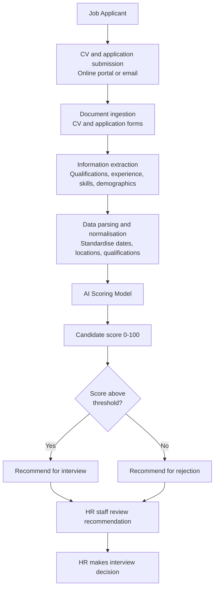

## Scenario 4 - AI Recruitment Screening

**Risk level:** High

### Business Problem

Telleion Hospitals NHS Foundation Trust receives hundreds of applications annually for clinical and non-clinical roles. Human Resources manually screens CVs and applications, assessing candidate suitability against job requirements. This process is time-consuming, inconsistent (different screeners apply different standards), and creates bottlenecks in recruitment.

The Trust wants to standardise screening, reduce Time-to-Hire, and enable HR staff to focus on interview management and candidate experience rather than administrative screening. Improving recruitment efficiency is an organisational priority.

### Proposed Solution

The HR department proposes an AI-powered recruitment screening system. The system:

1. **Ingests applicant data:** Receives CVs, application forms, and job applications (text, PDF)
2. **Extracts information:** Parses CV and application to extract: name, contact information, qualifications, experience, employment history, skills, education dates, location, demographic information (if present)
3. **Compares with job requirements:** Matches candidate attributes against the job specification: required qualifications, minimum experience, essential skills, preferred experience, location requirements
4. **Generates candidate score:** Produces a numerical score (0–100) representing suitability for the role
5. **Recommends for interview:** Recommends candidates scoring above a configurable threshold for interview

The system produces a ranked list of candidates for HR review. HR staff make final interview decisions.

**Scenario status:** Proposed. This scenario does not constitute approval for deployment.

### Processing Flow

### Data Involved

Data potentially processed includes:

- Applicant name, contact information (email, phone, address)
- Demographics (age inferred from graduation dates, explicitly stated if provided)
- Sex/gender (inferred from pronouns or explicitly stated)
- Ethnicity (if applicant voluntarily provides on equal-opportunities form)
- Disability status (if applicant voluntarily discloses)
- Sexual orientation, gender reassignment, religion/belief (if disclosed)
- Marital/family status (inferred from CV or stated)
- Location/relocation status
- Educational qualifications, institutions, dates
- Employment history, job titles, dates, employers, responsibilities
- Skills and competencies
- Certifications, licenses, professional memberships
- Languages spoken
- Gaps in employment
- Career progression patterns
- Salary expectations (if provided)
- Reasons for job change (inferred from CV)
- Volunteering and community involvement

The exact data retention, processing purposes, use for model training, access by third parties, and algorithmic decision-making transparency remain governance questions to evidence.

### Third Party

The AI recruitment screening system may be:

- Developed internally by the Trust's IT department using general machine-learning frameworks
- Acquired from a commercial recruitment AI vendor (e.g. Pymetrics, HireVue, Workable, LinkedIn Recruiter)
- Built on a cloud-hosted AI platform (e.g. Azure AI, AWS SageMaker, Google Vertex AI) with custom model training

If vendor-supplied or cloud-hosted, the following require assessment:

- Vendor track record in healthcare or high-regulation sectors
- Whether the model is trained on applicant data from other organisations
- Training data composition and known biases in training data
- Data location and processing jurisdiction
- Whether vendor or cloud provider can access applicant data for model improvement, analytics, or research
- Audit rights and model interpretability (can the Trust understand why candidate was scored low?)
- Procedures for model updates, retraining, or configuration changes
- Data deletion, export, and exit strategy if system is discontinued
- Incident notification and management obligations
- Liability, indemnity, and insurance, particularly for discrimination or wrongful rejection claims
- Regulatory compliance with UK GDPR, Equality Act 2010, Data Protection Act 2018, employment law

### Governance Questions

The AI Governance team must determine:

1. **Model Development & Validation**
   - What training data was used to develop the model?
   - What was the demographic composition of the training data (age, sex, ethnicity, disability)?
   - Was training data representative of the Trust's applicant pool?
   - Has the model been validated for fairness across protected characteristics?
   - What is the model's accuracy, false-positive rate, false-negative rate overall and by demographic group?
   - How does the model perform for underrepresented groups (e.g. older applicants, disabled applicants, ethnic minorities)?
   - Are there known or suspected biases in the model?

2. **Fairness & Discrimination Risk**
   - Does the model exhibit disparate impact (systematically disadvantaging applicants with protected characteristics)?
   - Is the model's scoring methodology transparent and auditable?
   - Could the model's decisions be explained to applicants if they request?
   - Are there proxy variables (e.g. employment gaps that correlate with childcare/caring responsibilities) that indirectly discriminate?
   - How will gender bias, age bias, ethnic bias, disability bias be monitored in operation?
   - What is the Trust's legal liability if the model discriminates against a protected group?
   - What redress is available to applicants disadvantaged by the model?

3. **Data Representation & Bias**
   - What is the demographic composition of applicants who score highly vs. poorly?
   - Are certain demographic groups systematically scored lower or higher?
   - Is there a scoring gap (e.g. younger applicants score 10% higher on average than older applicants)?
   - How many applicants of each protected characteristic are recommended for interview vs. rejected?
   - Is the interview conversion rate different by demographic group (do men convert at higher rate than women)?
   - Are job offers made at different rates for different demographic groups?

4. **False Positive & False Negative Rates**
   - What percentage of applicants recommended by AI are actually hired (positive predictive value)?
   - What percentage of rejected applicants would have been hired if interviewed (false-negative rate)?
   - Does false-negative rate differ by demographic group (e.g. talented women rejected at higher rate)?
   - What is the cost of false negatives (losing good candidates) vs. false positives (interviewing unsuitable candidates)?

5. **Human Oversight & Decision-Making**
   - Does HR staff review all AI recommendations, or does the system auto-reject below-threshold applicants?
   - Can HR override AI recommendations?
   - What is the override rate (how often does HR disagree with AI)?
   - Does HR understand the basis for AI scoring, or is the system a "black box"?
   - How is the AI recommendation weighted vs. HR judgment in final interview decision?
   - Are applicants informed that their application was screened by AI?
   - Can applicants request human review or explanation of their score?

6. **Protected Characteristics & Legal Compliance**
   - Does the model use protected characteristics (age, sex, ethnicity, disability) in scoring?
   - Does the model use proxy variables that correlate with protected characteristics?
   - Is the model trained on data that includes disparate treatment or discrimination?
   - Does the model violate the Equality Act 2010 (direct or indirect discrimination)?
   - What is the Trust's legal risk if applicants claim discrimination?
   - How does the Trust demonstrate compliance with employment equality law?

7. **Data Processing & Privacy**
   - What is the legal basis for collecting and processing applicant data (including demographics)?
   - Are applicants informed about AI screening and their data use?
   - Is consent obtained for use of personal data for AI analysis?
   - How long is applicant data retained (successful hires, unsuccessful applicants)?
   - Is applicant data used for model retraining or analytics?
   - Is applicant data shared with the vendor or third parties?
   - Can applicants request access to their data (GDPR Subject Access Request)?
   - Can applicants request deletion of their data?

8. **Monitoring & Continuous Assessment**
   - How will the model's performance be monitored in operation?
   - What metrics will be tracked: hiring rate, interview conversion rate, job performance of hired candidates, retention rate by demographic group?
   - How frequently will fairness/bias be assessed?
   - Who is responsible for monitoring?
   - What is the escalation pathway if bias is detected?
   - How will the system be adjusted, restricted, or retired if harm is detected?
   - Will there be ongoing independent audit or external fairness review?

9. **Vendor Management** (if applicable)
   - What validation testing has the vendor completed for fairness?
   - What fairness benchmarks or certifications does the vendor claim?
   - What training data was used for the vendor's general model?
   - What are the vendor's audit rights and transparency commitments?
   - What liability does the vendor accept for discriminatory outcomes?
   - Does the vendor commit to regular fairness audits and remediation?
   - What is the contract termination and exit strategy?

### Initial Governance Scope

Assess this use case through the portfolio workflows for:

- **Fairness & Discrimination Risk:** Disparate impact by protected characteristic (age, sex, ethnicity, disability, sexual orientation, religion, gender reassignment, pregnancy), false-negative rates by group, scoring gaps, interview conversion rates by demographic group, legal liability under Equality Act 2010.

- **Data Representation & Bias:** Training data composition; representation of underrepresented groups; known biases; proxy variables; algorithmic transparency and auditability.

- **Model Validation & Accuracy:** Validation across protected characteristics; performance metrics (accuracy, precision, recall, false-positive, false-negative rates) overall and by demographic group; performance on underrepresented groups.

- **Transparency & Accountability:** Explainability of scores to applicants; human override capability; decision-making trails; applicant notification of AI use; redress mechanisms; applicant rights to explanation and challenge.

- **Data Protection & Privacy:** Legal basis for data collection, consent, retention and deletion, use for model retraining, data sharing with vendors, GDPR compliance, applicant data subject rights (access, deletion, portability).

- **Human Oversight & Decision-Making:** Extent of human review and override; training for HR staff on AI limitations and bias; integration of AI score with human judgment; final decision authority.

- **Vendor Management** (if applicable): Vendor fairness validation, audit rights, liability for discrimination, contract terms protecting the Trust from discriminatory outcomes, exit strategy.

- **Monitoring & Continuous Assurance:** Monitoring cadence and metrics; fairness assessment in operation; bias detection triggers; incident response; remediation procedures; periodic independent audit.

- **Lifecycle Governance:** Pilot scope and fairness assessment, approval gates requiring fairness sign-off, deployment safeguards, monitoring and adjustment procedures, pause/suspension criteria if bias detected.

The decision requested is whether the AI recruitment screening system can proceed to pilot testing with fairness validation, and under what evidence, controls, assurance conditions, risk-tolerance decision, and accountability arrangements.
